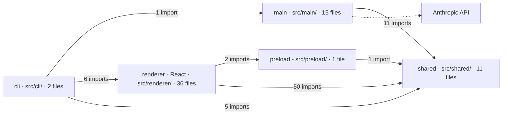

<!-- Generated by Cartographer (crtgrphr). Re-run the scan to update. -->

```mermaid
flowchart LR
  dir_src_cli["cli - src/cli/ · 2 files"]
  dir_src_main["main - src/main/ · 15 files"]
  dir_src_preload["preload - src/preload/ · 1 file"]
  dir_src_renderer["renderer - React · src/renderer/ · 36 files"]
  dir_src_shared["shared - src/shared/ · 11 files"]
  anthropic_api["Anthropic API"]
  dir_src_cli -->|"1 import"| dir_src_main
  dir_src_cli -->|"6 imports"| dir_src_renderer
  dir_src_cli -->|"5 imports"| dir_src_shared
  dir_src_main -->|"11 imports"| dir_src_shared
  dir_src_preload -->|"1 import"| dir_src_shared
  dir_src_renderer -->|"2 imports"| dir_src_preload
  dir_src_renderer -->|"50 imports"| dir_src_shared
  dir_src_main -.-> anthropic_api
  class dir_src_cli,dir_src_main,dir_src_preload,dir_src_shared backend
  class dir_src_renderer frontend
  class anthropic_api service
```
